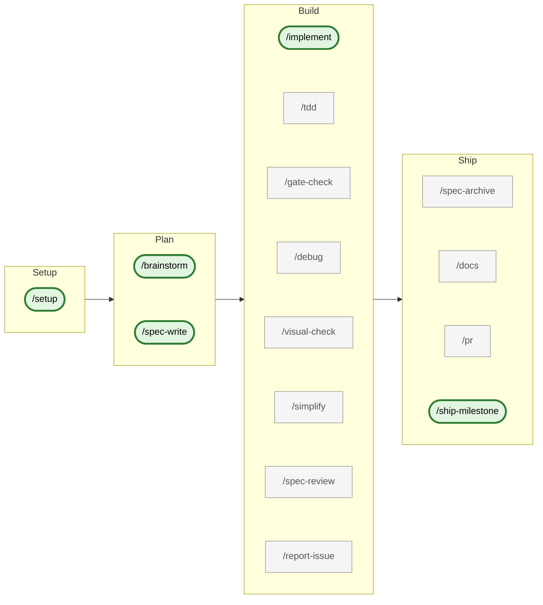

# Dev Process Toolkit

A Claude Code plugin that adds **Spec-Driven Development (SDD)** and **TDD** workflows to any project. Includes 16 commands, 8 agents, spec templates, and documentation.

## Features

- **Spec-Driven Development (SDD)** — requirements, technical, testing, and plan files as the source of truth
- **Multi-agent TDD orchestrator** — `/tdd` runs RED → GREEN → REFACTOR → AUDIT via four forked subagents (`tdd-test-writer`, `tdd-implementer`, `tdd-refactorer`, `tdd-spec-reviewer`) with context isolation, a strict `tdd-result` YAML hand-off, and bounded retries; `/implement` invokes it inline per FR
- **Bounded three-stage self-review** — Stage A spec compliance → Stage B two-pass `code-reviewer` agent (Pass 1 spec compliance, Pass 2 code quality, fail-fast) → Stage C hardening, capped before human escalation
- **Deterministic quality gates** — 67 numbered `/gate-check` probes (typecheck + lint + test + spec/plan/frontmatter/branch hygiene) override LLM judgment
- **Universal pre-commit branch gate** — every commit-producing skill calls `requireCommittableBranch`; trunk-OK narrows to `ci` only, so `chore`/`docs`/`feat` cannot land on `main` accidentally
- **Non-technical drafting (`--no-tech`)** — `/brainstorm` and `/spec-write` skip the technical-design + testing interviews; FR ships with `needs_technical_review: true` and `/implement` refuses until a reviewer fills it in
- **Topic-aware spec retrieval** — `spec-researcher` Read-only Haiku subagent (invoked by `/brainstorm` and `/spec-write` via the `spec-research` fork) returns related FRs from active + archived specs as a fixed-shape ≤ 25-line block, no parent-context pollution
- **Dependency docs catalog** — `/deps` manages a git-tracked `specs/deps.yaml` manifest of sibling packages (add/edit/delete/list/sync); a `deps-researcher` Read-only Haiku subagent (invoked by `/brainstorm` and `/spec-write` via the `deps-research` fork) folds each sibling's `docs/` tree into design context as a fixed-shape ≤ 25-line block, so consumer projects with several private packages stop rediscovering APIs
- **Privacy-first incident reports** — `/report-issue` bundles repo state + dev narrative, scrubs secrets via 7 patterns (Anthropic / OpenAI / GitHub PAT / AWS / JWT / generic / AWS-secret), previews before publish, then posts a secret GitHub gist; the URL round-trips into `/brainstorm <gist-url>` for self-debug
- **Diátaxis docs generation** — `/docs` stages fragments per FR (`--quick`), merges with human approval (`--commit`), or regenerates the canonical tree (`--full`)
- **Task tracker sync** — Linear, Jira, or `none`; auto-claim on FR start, auto-release on archive; adapter-agnostic `Provider` interface
- **Conventional Commits v1.0.0** — local `commit-msg` hook (POSIX shell by default or opt-in `commitlint`)
- **Atomic release commits** — `/ship-milestone` enforces the multi-file Release Checklist + folds staged doc fragments into the canonical tree in one commit
- **Spec lifecycle management** — ULID-keyed FRs, `/spec-archive` for manual archival by ULID / tracker ID / `M<N>`, post-archive drift checks
- **Browser-based UI verification** — `/visual-check` via Chrome DevTools MCP
- **Project-authored verification skills** — declare a `verify_skill` in a `## Verification` block and `/implement`'s Phase 4b″ runs your project's own "does it actually run / look right?" check after the gate passes; `/setup` and `/implement` scaffold a stack-aware stub, or fall back to `/visual-check` (see [`plugins/dev-process-toolkit/docs/verification-skills.md`](./plugins/dev-process-toolkit/docs/verification-skills.md))
- **Stack-adaptive setup** — auto-detects TypeScript, Flutter, Python, Kotlin; generates `CLAUDE.md`, settings, and the `commit-msg` hook

## Install as Plugin

```
/plugin marketplace add nesquikm/dev-process-toolkit
```

```
/plugin install dev-process-toolkit@dev-process-toolkit
```

Then run the setup command in your project:

```
/dev-process-toolkit:setup
```

This detects your stack, generates a CLAUDE.md, configures settings, and optionally creates spec files — all adapted to your project.

## Prerequisites

**[bun](https://bun.sh) must be installed.** The toolkit's `adapters/_shared` TypeScript helpers and tracker adapters — invoked by skills via `bun run` — execute on bun, **regardless of your own project's stack**. This is a requirement of the toolkit's own machinery, not of your code: a Flutter project still gates via `fvm flutter`, a Python project via its own toolchain. You do not rewrite your project in TypeScript or adopt bun for your own gates.

Install bun and verify:

```
curl -fsSL https://bun.sh/install | bash
bun --version
```

## Workflow

The toolkit groups its 16 user-invoked skills into a four-phase lifecycle. Read left-to-right for the full path, or jump to whichever phase matches what you're doing now.



Under the hood, `/implement` invokes the `/tdd` orchestrator inline per FR — `/tdd` forks four subagents (`tdd-test-writer`, `tdd-implementer`, `tdd-refactorer`, `tdd-spec-reviewer`) into isolated contexts and parses their `tdd-result` YAML hand-off. It runs gate commands inline (e.g., `bun test`) rather than invoking the `/gate-check` skill (which layers 67 probes on top of those commands), and invokes `/docs --quick` once per FR for the Phase 4b doc fragment. `/brainstorm` and `/spec-write` similarly fork the read-only `spec-research` skill (paired with the `spec-researcher` Haiku subagent) for topic-aware retrieval of related active + archived FRs. After self-review and human approval, `/implement` commits and stops — you open the PR via `/pr` separately. `/ship-milestone` invokes `/docs --commit --full` to fold staged fragments into the canonical docs tree before cutting the release commit.

Spine skills (bold, stadium-shaped) are the recommended invoke path; secondary skills (muted rectangles) are auxiliary tools and auto-invoked helpers.

Tracker integration (Linear, Jira, or `mode: none`) threads through Plan → Build → Ship: `/spec-write` files the FR, `/implement` claims it on entry and releases on success, and `/ship-milestone` archives the milestone group.

All commits in toolkit-managed repositories follow [Conventional Commits v1.0.0](https://www.conventionalcommits.org/en/v1.0.0/), enforced locally by a `commit-msg` hook that `/setup` installs (a POSIX-shell hook by default; opt into `--commitlint` for projects with Node/Bun tooling).

> The diagram above is a deliberately high-level lifecycle map. For the mechanics it omits — the TDD and self-review loops, the deterministic gates/evals, the `spec-research` / `deps-research` forks, and every artifact-write point — see [`docs/workflow-overview.md`](plugins/dev-process-toolkit/docs/workflow-overview.md).

## What You Get

### Commands

Commands are invoked with the `/dev-process-toolkit:` plugin-namespace prefix in actual use; the prefix is omitted from the table for readability (matches the Agents-table convention below). The `Args` column mirrors each skill's `argument-hint:` frontmatter — surfaced here because Claude Code does not yet render argument hints in autocomplete for plugin-namespaced skills (upstream issue [#43401](https://github.com/anthropics/claude-code/issues/43401)). `—` marks a skill that takes no arguments.

| Command           | Purpose                                                                                                                                                                                                                                                            | Args                                                                       |
| ----------------- | ------------------------------------------------------------------------------------------------------------------------------------------------------------------------------------------------------------------------------------------------------------------ | -------------------------------------------------------------------------- |
| `/setup`          | Set up SDD/TDD process for your project                                                                                                                                                                                                                            | `[new or existing]`                                                        |
| `/brainstorm`     | Socratic design session before writing specs (for open-ended features)                                                                                                                                                                                             | `[--no-tech] [<feature or problem description> \| <gist-url>]`             |
| `/spec-write`     | Guide through writing spec files (requirements, technical, testing, plan)                                                                                                                                                                                          | `[--no-tech] [requirements \| technical \| testing \| plan \| all]`        |
| `/implement`      | End-to-end feature implementation with TDD and bounded three-stage self-review (Stage A spec compliance → Stage B two-pass delegated review: Pass 1 spec compliance, Pass 2 code quality, fail-fast → Stage C hardening)                                           | `<milestone, task description, issue number, "next", or "all">`            |
| `/tdd`            | RED → GREEN → REFACTOR → AUDIT cycle                                                                                                                                                                                                                                         | `<FR-id>`                                                                  |
| `/gate-check`     | Deterministic quality gates (typecheck + lint + test)                                                                                                                                                                                                              | `[--fix to auto-fix lint issues]`                                          |
| `/debug`          | Structured debugging protocol for failing tests or unclear gate failures                                                                                                                                                                                           | `<failing test, error message, or symptom>`                                |
| `/spec-review`    | Audit code against spec requirements                                                                                                                                                                                                                               | `[requirement-id or 'all']`                                                |
| `/spec-archive`   | Manually archive a FR (by ULID or tracker ref) or milestone (`M<N>` group) via `git mv` into `specs/frs/archive/` / `specs/plan/archive/` with diff approval; runs a post-archive drift check (Pass A grep + Pass B semantic scan) on finish (FR-17, FR-21, FR-45) | `<ULID, tracker ID, tracker URL, or M<N>>`                                 |
| `/visual-check`   | Browser-based UI verification via MCP                                                                                                                                                                                                                              | `[page-path] [checklist items...]`                                         |
| `/docs`           | Generate or update project docs — staged fragments (`--quick`), human-approved merge (`--commit`), or full canonical regeneration (`--full`)                                                                                                                       | `<--quick \| --commit \| --full>`                                          |
| `/pr`             | Pull request creation                                                                                                                                                                                                                                              | —                                                                          |
| `/simplify`       | Code quality review and cleanup                                                                                                                                                                                                                                    | `[focus area]`                                                             |
| `/report-issue`   | Capture a structured bug report (narrative + redacted curated context, optional session transcript), preview, and publish to a secret GitHub gist for triage or self-debug via `/brainstorm <gist-url>`                                                            | `[--full]`                                                                 |
| `/ship-milestone` | Bundle the Release Checklist + `/docs --commit --full` into one atomic, human-approved release commit                                                                                                                                                              | `[M<N>] [--version X.Y.Z] [--codename "<name>"] [--summary "<text>"]`      |
| `/deps`           | Manage a git-tracked `specs/deps.yaml` manifest of sibling packages — Socratic `add` / `edit` / `delete` / `list` / `sync` subcommands; underpins the `deps-research` retrieval fork that feeds `/brainstorm` and `/spec-write`                                    | `<subcommand> [args...]`                                                   |

Seven additional skills (`spec-research`, `spec-review-audit`, `tdd-write-test`, `tdd-implement`, `tdd-refactor`, `tdd-spec-review`, `deps-research`) are not user-invocable — they run only as `context: fork` children of `/brainstorm`, `/spec-write`, `/spec-review`, and `/tdd`.

### Agents

| Agent                | Purpose                                                                                                                                              |
| -------------------- | ---------------------------------------------------------------------------------------------------------------------------------------------------- |
| `code-reviewer`      | Quality / security / patterns review rubric with pass-specific contracts; invoked twice by `/implement` Stage B (spec compliance → code quality)     |
| `spec-researcher`    | Read-only Haiku that scans `specs/frs/**` (active + archived) and emits a fixed-shape ≤ 25-line block of related FRs / prior decisions / reusable ACs |
| `tdd-test-writer`    | Writes failing tests for the full AC list of one FR and runs them once to confirm RED — invoked once per FR by `/tdd`                                |
| `tdd-implementer`    | Implements the minimum code to turn one AC's failing test GREEN — invoked once per AC by `/tdd`                                                      |
| `tdd-refactorer`     | Cleans up cross-AC duplication while keeping every test GREEN — invoked once at end of FR by `/tdd`                                                  |
| `tdd-spec-reviewer`  | Read-only Sonnet that traces every AC of one FR to file + test post-REFACTOR; emits a closed-schema audit block and blocks the pipeline only on missing ACs (bounded single-round auto-retry) — invoked once at end of FR by `/tdd`                                |
| `deps-researcher`    | Read-only Haiku that scans manifest-listed sibling packages' `docs/` trees and emits a fixed-shape ≤ 25-line block of relevant packages + verbatim API signatures + reusable patterns — invoked by `/brainstorm` Step 1.5b and `/spec-write` § 0b step 2.5b           |

## What's Inside

```
dev-process-toolkit/
├── .claude-plugin/
│   └── marketplace.json            # Marketplace catalog
├── plugins/
│   └── dev-process-toolkit/         # The plugin
│       ├── .claude-plugin/
│       │   └── plugin.json          # Plugin manifest
│       ├── skills/                  # 23 (16 + 7) skills (16 user-invocable + 7 internal forks)
│       ├── agents/                  # 8 specialist agents (code-reviewer, spec-researcher, spec-reviewer, deps-researcher, tdd-{test-writer,implementer,refactorer,spec-reviewer})
│       ├── adapters/                # 3 tracker adapters (linear, jira, _template) + _shared helpers
│       ├── templates/               # CLAUDE.md and spec templates
│       ├── docs/                    # Methodology and guides
│       ├── tests/                   # Pattern 9 regression fixture + capture/verify scripts + MCP/project fixtures
│       └── examples/                # Stack-specific configs
├── CLAUDE.md
├── README.md
└── LICENSE
```

## Release Notes

See [`CHANGELOG.md`](./CHANGELOG.md) for the full release history. Latest: **v2.48.1 — "Errata"** (M107 sweeps three stale branch-automation phrasings out of the shipped docs — the template’s trunk-OK comment now names only `ci`, the placeholder docs describe `{type}` as deterministically derived via `branchTypeFor`, and the technical spec names the single canonical seeded default — and clears all five probe-#37 tree-leaf advisories, with a new doc-conformance meta-test pinning the corrections and a dogfood assertion holding the probe at zero violations.)

## Core Philosophy

Three layers prevent AI agents from going off the rails:

1. **Specs** — Human-written requirements are the source of truth
2. **Deterministic gates** — Typecheck + lint + test must pass (no LLM judgment)
3. **Bounded self-review** — Max 2 rounds, then escalate to human

The key insight: **deterministic checks always override LLM judgment**. A failing test means "fix it," not "maybe it's fine."

## Proven Across

- **TypeScript/React/Vite** — web analytics dashboard
- **TypeScript/Node/MCP** — MCP server
- **Flutter/Dart** — retail mobile app

### Examples Provided For

- **Python** — stack-detection config + CLAUDE.md template under `plugins/dev-process-toolkit/examples/python/` (not dogfooded in production by the plugin author, but the `/setup` detection path and example config are maintained alongside the TypeScript and Flutter examples).
- **Kotlin** — stack-detection config + CLAUDE.md template under `plugins/dev-process-toolkit/examples/kotlin/` (not dogfooded in production by the plugin author, but the `/setup` detection path and example config are maintained alongside the TypeScript and Flutter examples).

## Documentation

- [`plugins/dev-process-toolkit/docs/sdd-methodology.md`](plugins/dev-process-toolkit/docs/sdd-methodology.md) — What SDD is and how it works
- [`plugins/dev-process-toolkit/docs/skill-anatomy.md`](plugins/dev-process-toolkit/docs/skill-anatomy.md) — How Claude Code skills work
- [`plugins/dev-process-toolkit/docs/adaptation-guide.md`](plugins/dev-process-toolkit/docs/adaptation-guide.md) — Reference for customizing skills and configuration after `/setup`
- [`plugins/dev-process-toolkit/docs/patterns.md`](plugins/dev-process-toolkit/docs/patterns.md) — 25 proven patterns + anti-patterns
- [`plugins/dev-process-toolkit/docs/layout-reference.md`](plugins/dev-process-toolkit/docs/layout-reference.md) — spec layout behavioral contract (file-per-FR keyed by tracker ID / short-ULID; ULID in frontmatter; Provider interface; skill integration map)
- [`plugins/dev-process-toolkit/docs/workflow-overview.md`](plugins/dev-process-toolkit/docs/workflow-overview.md) — End-to-end workflow map: phases, loops, evals, researcher forks, and artifact-write points

**Claude Code official docs:** https://code.claude.com/docs/en
