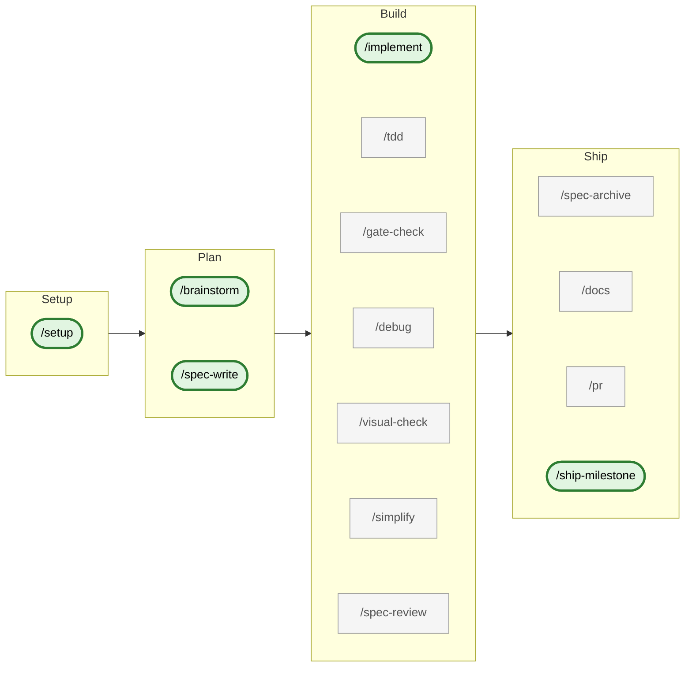

# Dev Process Toolkit

A Claude Code plugin that adds **Spec-Driven Development (SDD)** and **TDD** workflows to any project. Includes 14 commands, 1 agent, spec templates, and documentation.

## Features

- **Spec-Driven Development (SDD)** — requirements, technical, testing, and plan files as the source of truth
- **Test-Driven Development (TDD)** — RED → GREEN → VERIFY cycle, performed inline by `/implement`
- **Bounded self-review** — three-stage loop with a delegated `code-reviewer` agent, capped before human escalation
- **Deterministic quality gates** — typecheck + lint + test override LLM judgment
- **Diátaxis docs generation** — staged fragments per FR, human-approved merge, full canonical regen
- **Task tracker sync** — Linear, Jira, or `none`; auto-claim on FR start, auto-release on archive
- **Conventional Commits v1.0.0** — local `commit-msg` hook (POSIX shell or opt-in `commitlint`)
- **Atomic release commits** — `/ship-milestone` enforces the five-file release checklist
- **Spec lifecycle management** — ULID-keyed FRs, manual archival, post-archive drift checks
- **Browser-based UI verification** — `/visual-check` via Chrome DevTools MCP
- **Stack-adaptive setup** — auto-detects TypeScript, Flutter, Python; generates `CLAUDE.md` and settings

## Install as Plugin

```
/plugin marketplace add nesquikm/dev-process-toolkit
```

```
/plugin install dev-process-toolkit@nesquikm-dev-process-toolkit
```

Then run the setup command in your project:

```
/dev-process-toolkit:setup
```

This detects your stack, generates a CLAUDE.md, configures settings, and optionally creates spec files — all adapted to your project.

## Workflow

The toolkit groups its 14 user-invoked skills into a four-phase lifecycle. Read left-to-right for the full path, or jump to whichever phase matches what you're doing now.



Under the hood, `/implement` performs TDD inline (write test → RED → code → GREEN) rather than invoking the `/tdd` skill, and runs gate commands inline (e.g., `bun test`) rather than invoking the `/gate-check` skill (which layers probes on top of those commands). It does invoke `/docs --quick` once per FR for the Phase 4b doc fragment. After self-review and human approval, `/implement` commits and stops — you open the PR via `/pr` separately. `/ship-milestone` invokes `/docs --commit --full` to fold staged fragments into the canonical docs tree before cutting the release commit.

Spine skills (bold, stadium-shaped) are the recommended invoke path; secondary skills (muted rectangles) are auxiliary tools and auto-invoked helpers.

Tracker integration (Linear, Jira, or `mode: none`) threads through Plan → Build → Ship: `/spec-write` files the FR, `/implement` claims it on entry and releases on success, and `/ship-milestone` archives the milestone group.

All commits in toolkit-managed repositories follow [Conventional Commits v1.0.0](https://www.conventionalcommits.org/en/v1.0.0/), enforced locally by a `commit-msg` hook that `/setup` installs (a POSIX-shell hook by default; opt into `--commitlint` for projects with Node/Bun tooling).

## What You Get

### Commands

| Command                               | Purpose                                                                                                                                                                                                                                                            |
| ------------------------------------- | ------------------------------------------------------------------------------------------------------------------------------------------------------------------------------------------------------------------------------------------------------------------ |
| `/dev-process-toolkit:setup`          | Set up SDD/TDD process for your project                                                                                                                                                                                                                            |
| `/dev-process-toolkit:brainstorm`     | Socratic design session before writing specs (for open-ended features)                                                                                                                                                                                             |
| `/dev-process-toolkit:spec-write`     | Guide through writing spec files (requirements, technical, testing, plan)                                                                                                                                                                                          |
| `/dev-process-toolkit:implement`      | End-to-end feature implementation with TDD and bounded three-stage self-review (Stage A spec compliance → Stage B two-pass delegated review: Pass 1 spec compliance, Pass 2 code quality, fail-fast → Stage C hardening)                                           |
| `/dev-process-toolkit:tdd`            | RED → GREEN → VERIFY cycle                                                                                                                                                                                                                                         |
| `/dev-process-toolkit:gate-check`     | Deterministic quality gates (typecheck + lint + test)                                                                                                                                                                                                              |
| `/dev-process-toolkit:debug`          | Structured debugging protocol for failing tests or unclear gate failures                                                                                                                                                                                           |
| `/dev-process-toolkit:spec-review`    | Audit code against spec requirements                                                                                                                                                                                                                               |
| `/dev-process-toolkit:spec-archive`   | Manually archive a FR (by ULID or tracker ref) or milestone (`M<N>` group) via `git mv` into `specs/frs/archive/` / `specs/plan/archive/` with diff approval; runs a post-archive drift check (Pass A grep + Pass B semantic scan) on finish (FR-17, FR-21, FR-45) |
| `/dev-process-toolkit:visual-check`   | Browser-based UI verification via MCP                                                                                                                                                                                                                              |
| `/dev-process-toolkit:docs`           | Generate or update project docs — staged fragments (`--quick`), human-approved merge (`--commit`), or full canonical regeneration (`--full`)                                                                                                                       |
| `/dev-process-toolkit:pr`             | Pull request creation                                                                                                                                                                                                                                              |
| `/dev-process-toolkit:simplify`       | Code quality review and cleanup                                                                                                                                                                                                                                    |
| `/dev-process-toolkit:ship-milestone` | Bundle the Release Checklist + `/docs --commit --full` into one atomic, human-approved release commit                                                                                                                                                              |

### Agents

- **code-reviewer** — Canonical code review rubric (quality, security, patterns, stack-specific) plus pass-specific return contracts for the Stage B two-pass flow. Invoked twice by `/implement` Phase 3 Stage B via `Agent`-tool delegation — Pass 1 spec compliance (gated on `specs/requirements.md` existing; fail-fast), Pass 2 code quality; referenced inline by `/gate-check` Code Review.

## What's Inside

```
dev-process-toolkit/
├── .claude-plugin/
│   └── marketplace.json            # Marketplace catalog
├── plugins/
│   └── dev-process-toolkit/         # The plugin
│       ├── .claude-plugin/
│       │   └── plugin.json          # Plugin manifest
│       ├── skills/                  # 14 skills (slash commands)
│       ├── agents/                  # 1 specialist agent (code-reviewer)
│       ├── adapters/                # 3 tracker adapters (linear, jira, _template) + _shared helpers
│       ├── templates/               # CLAUDE.md and spec templates
│       ├── docs/                    # Methodology and guides
│       ├── tests/                   # Pattern 9 regression fixture + capture/verify scripts + MCP/project fixtures
│       └── examples/                # Stack-specific configs
├── CLAUDE.md
├── README.md
└── LICENSE
```

## Release Notes

See [`CHANGELOG.md`](./CHANGELOG.md) for the full release history. Latest: **v2.2.0 — "Polish"** (Smoke #6 / smoke #7 follow-up. `/implement` Stage D archive hardening — `appendTraceabilityRow`, `isFRUntrackedInPorcelain` + `git add` before `git mv`, filesystem-fallback in `cleanupPlanVerifyLines` — keeps milestone archives coherent. `/spec-review` drift refresh hint nudges operators when cross-cutting drift accumulates (`drift_count >= 2`). `/setup` and `/simplify` SKILL.md prose now document the best-effort commit-msg hook install and the no-op gate-skip conditional. `/smoke-test` driver gains Phase 0.5 scratch-reset, key-first Linear team probe, `--reset` escape hatch, optional Jira ghost detector pre-flight #9, and a stand-alone Jira comment-path probe (closes AC-STE-154.9 AC 6 coverage gap). Test count: 1289 → 1358 (+69).

## Core Philosophy

Three layers prevent AI agents from going off the rails:

1. **Specs** — Human-written requirements are the source of truth
2. **Deterministic gates** — Typecheck + lint + test must pass (no LLM judgment)
3. **Bounded self-review** — Max 2 rounds, then escalate to human

The key insight: **deterministic checks always override LLM judgment**. A failing test means "fix it," not "maybe it's fine."

## Proven Across

- **TypeScript/React/Vite** — web analytics dashboard
- **TypeScript/Node/MCP** — MCP server
- **Flutter/Dart** — retail mobile app

### Examples Provided For

- **Python** — stack-detection config + CLAUDE.md template under `plugins/dev-process-toolkit/examples/python/` (not dogfooded in production by the plugin author, but the `/setup` detection path and example config are maintained alongside the TypeScript and Flutter examples).

## Documentation

- `plugins/dev-process-toolkit/docs/sdd-methodology.md` — What SDD is and how it works
- `plugins/dev-process-toolkit/docs/skill-anatomy.md` — How Claude Code skills work
- `plugins/dev-process-toolkit/docs/adaptation-guide.md` — Reference for customizing skills and configuration after `/setup`
- `plugins/dev-process-toolkit/docs/patterns.md` — 25 proven patterns + anti-patterns
- `plugins/dev-process-toolkit/docs/layout-reference.md` — spec layout behavioral contract (file-per-FR keyed by tracker ID / short-ULID; ULID in frontmatter; Provider interface; skill integration map)

**Claude Code official docs:** https://code.claude.com/docs/en
