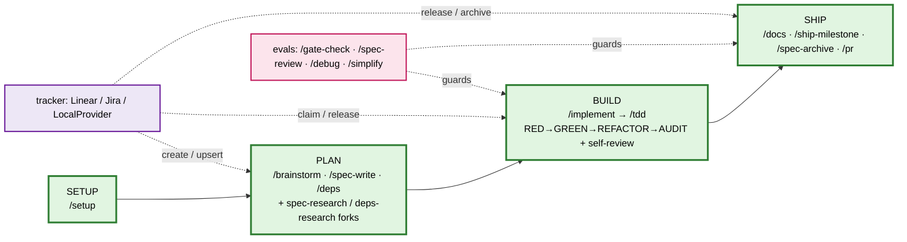
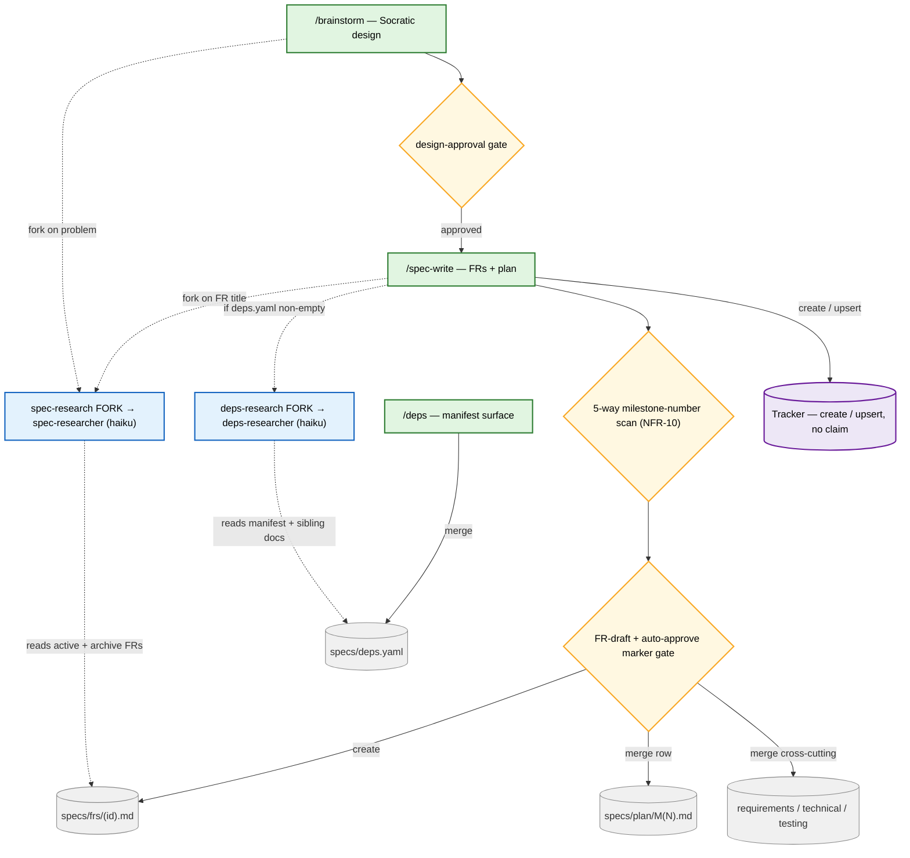
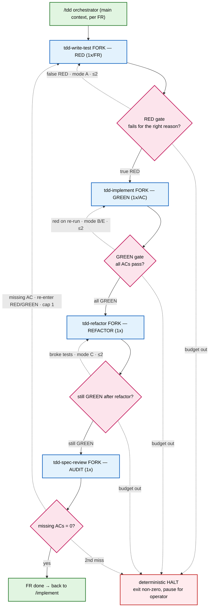
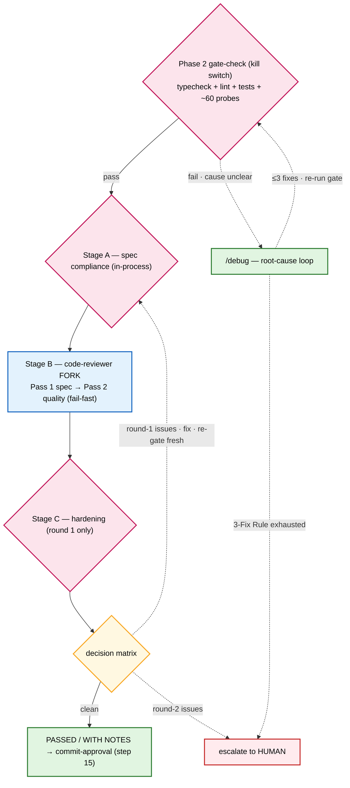
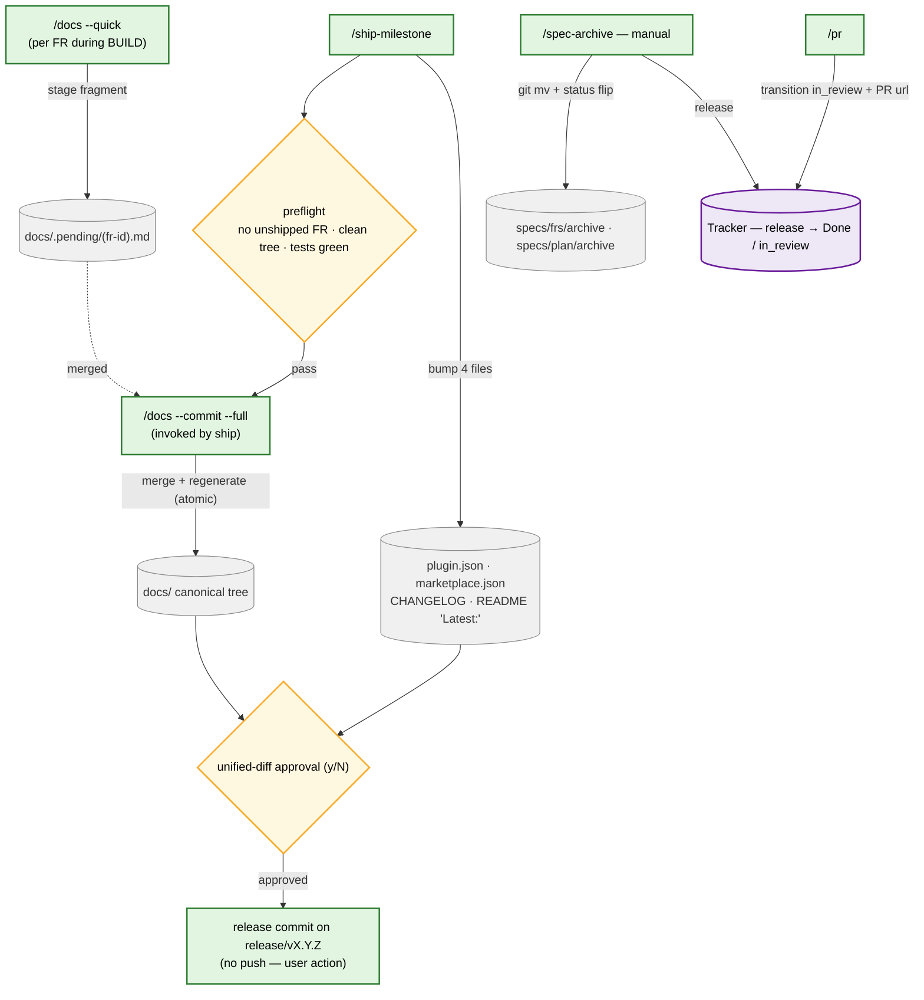

# Toolkit Workflow Map

> **Companion to the README diagram.** The `## Workflow` flowchart in `README.md` is a deliberately minimal lifecycle map (four phases, skills as nodes, no inter-skill edges — per FR STE-130/M34). This doc is the mechanics view it intentionally leaves out: the **loops**, **evals/gates**, **researcher forks**, and **artifact-write points**. It is layered — a slim lifecycle diagram first, then one detail diagram per loop-bearing phase, then two reference tables.

## 1. Lifecycle at a glance

The four phases run left-to-right; cross-cutting evals and the tracker thread through Build and Ship.

## 2. Plan + Research (detail)

`/brainstorm` and `/spec-write` each fork a read-only researcher (`spec-research`, and `deps-research` when `specs/deps.yaml` is non-empty) for topic-aware retrieval before any artifact is written. The 5-way milestone-number scan and the auto-approve marker gate guard the write.

## 3. Build — the TDD loop (detail)

`/implement` invokes the `/tdd` orchestrator inline, once per FR. `/tdd` stays in the main context and drives four forked subagents through RED → GREEN → REFACTOR → AUDIT. Every stage re-runs the gate command as a deterministic eval; failures route to a bounded semantic retry (≤2 per role per AC), and exhausting the budget halts deterministically.

## 4. Build — gate + self-review loop (detail)

After the FR is GREEN, `/implement` runs the Phase 2 gate-check (deterministic kill switch) then a three-stage self-review bounded to **max 2 rounds**. A failing gate with an unclear cause routes into `/debug` (3-Fix Rule). Round-2 issues — or an exhausted debug budget — escalate to the human (Core Principle 3).

## 5. Ship + artifact lifecycle (detail)

`/docs --quick` stages one fragment per FR during Build. `/ship-milestone` runs preflight, invokes `/docs --commit --full` to fold the staged fragments into the canonical tree, bumps the four release files, and lands one human-approved commit (no push). `/spec-archive` is the manual archive escape hatch; `/pr` opens the pull request.

## Loops & evals reference

| Loop / Eval | Where | Bound | On-fail |
|---|---|---|---|
| Socratic clarification (loop) | /brainstorm Step 1 | one Q/turn until clear (~2-4 Qs) | no retry budget; halts at design-approval gate |
| Design-approval gate (det.) | /brainstorm Step 3 | one explicit human approval | no spec writing until approved |
| Socratic spec interview (loop) | /spec-write sections 1-6 | one AskUserQuestion per section | converges to draft + commit gates |
| FR-draft approval gate (det.) | /spec-write step 4 | human approves Summary + Requirement + Acceptance Criteria; Technical Design + Testing are gate- and audit-verified | no save until approved |
| Consistency cross-check (loop) | /spec-write Step 5 | one row per cross-spec inconsistency | fix-now per-change approval, else "still pending" |
| Per-AC bidirectional diff/resolve | /spec-write 0.5 + /implement 0.3 | one prompt per non-identical AC | per-AC cancel aborts save, zero mutation |
| Tracker-create idempotency backoff | /spec-write upsert on 504/reset | 3 JQL probes, 1s+2s+4s | all miss → fresh create + uncertain row |
| Researcher line-cap truncation | spec/deps-researcher emit | <=25 lines | over-cap refused by probe #41 |
| spec_research_result_shape #41 | gate-check + parent | banner + 3 sections + <=25 lines + single fence | drop seed, emit shape_violation |
| spec_write_first_turn_drift_scan | gate-check vs SKILL.md | first non-tty call = AskUserQuestion or refusal | drift → GATE FAILED |
| Auto-approve marker byte-grep | /spec-write, /deps | PRESENT→default y; ABSENT+non-tty→refuse | sole decider, no inference |
| nextFreeMilestoneNumber 5-way scan | /spec-write plan alloc | max(active∪archived∪changelog∪tracker∪branches)+1 | collision → NFR-10 refusal |
| Post-write FR self-checks | /spec-write | frontmatter / guessed-id / short-ULID scans | shape error / placeholder → halt |
| Risk scan (llm-review) | /spec-write Step 6 | per high-severity risk | resolve or accept before hand-off |
| Deps Socratic mgmt flows | /deps add/edit/delete/sync | one prompt per step | DepsManifestShapeError (NFR-10) |
| Pre-flight branch isolation | /implement pre-flight | worktree vs current branch | partial-failure → cherry-pick/continue/discard |
| Tracker-availability pre-flight | /implement 0.a | zero tracker MCP tools | NFR-10 refuse OR `--code-only` degraded |
| needs_technical_review refusal | /implement 0.b' | per FR / whole milestone | hard NFR-10 refuse, zero side effects |
| Claim verification 0.d | /implement (tracker) | re-fetch in_progress AND assignee==me | mismatch → refuse Phase 2 (mode:none skips) |
| Baseline health gate | /implement Phase 1 step 4 | run gate before any code | broken → fix first |
| Phase 2 gate / kill switch | /implement step 11 | typecheck+lint+tests | fail → /debug; overrides all judgment |
| Spec-deviation classify (audit) | /implement step 9 | per deviation; always backfill spec+test | accumulates toward Spec Breakout |
| Spec Breakout threshold | /implement step 9 | >=3 contradicts/infeasible | STOP, emit report, recommend rewrite |
| TDD per-AC GREEN dispatch | /tdd GREEN | N forks for N ACs | each AC its own retry budget |
| TDD semantic retry | /tdd modes A/B/C/E | max 2 per role per AC | 2nd fail → halt report, exit non-zero |
| TDD format-violation retry | /tdd result parse | single targeted re-emit (mode D) | 2nd → halt |
| TDD audit-fix loop | /tdd AUDIT → RED/GREEN | 1 audit round (cap=1) | 2nd miss → halt w/ list |
| RED/GREEN/REFACTOR gates | /tdd re-runs command | RED→GREEN→still-GREEN | false-RED→A; RED-rerun→B/E; broken→C |
| AUDIT spec-trace (audit) | tdd-spec-reviewer (sonnet) | gate = missing_acs==0 | one bounded retry then halt |
| Phase 3 self-review loop | /implement Stage A→B→C | max 2 rounds (Stage C round 1 only) | round-2 → escalate to human |
| Stage B per-pass re-invoke | /implement Stage B Pass1/2 | round 1 re-invoke failing pass | Pass1 critical → fail-fast skip Pass2 |
| Phase 3 decision matrix | /implement | PASSED/WITH NOTES → exit; else loop | re-run full gate fresh, cite numbers |
| Commit-approval gate | /implement step 15 | one explicit human OK | reject → abort, lock stays |
| commit-msg CC hook | git hook | CC v1.0.0 subject <=72 | non-conforming → hard block |
| Post-release verification 4d | /implement Release | assert status==done (+updatedAt advanced) | mismatch → NFR-10 |
| Per-FR milestone iteration | /implement M(N) | N = active FR count | any FR fail → partial success |
| Gate commands | /gate-check | any fail ⇒ GATE FAILED | kill switch; no LLM downgrade |
| ~60 conformance probes (NFR-15) | /gate-check | error⇒FAIL, warn⇒NOTES | file:line — reason |
| Inline code review (5-criterion) | /gate-check | critical CONCERN⇒FAIL | cannot downgrade failing command |
| Drift check (audit) | /gate-check | implemented/not-found/no-AC | never FAILED; WITH NOTES |
| spec-review missing-AC halt | spec-reviewer → orchestrator | one bounded retry | >=1 Missing ⇒ halt |
| debug 3-Fix Rule | /debug Phase 3/4 | max 3 fixes | after 3 → question architecture, escalate |
| debug hypothesis testing | /debug Phase 3 | one change at a time, re-gate | revert failed fix (no stacking) |
| visual-check UI verification | /visual-check | pass/fail checklist | advisory only |
| DocsConfig gate | /docs (all flags) | >=1 of user_facing/packages true | both-false → refuse |
| Flag mutex | /docs | exactly one of quick/commit/full | 2+ → refuse NFR-10 |
| Nav-contract probe | /docs --commit | runNavContractProbe ok | false → refuse, fragments preserved |
| Quick verbatim validator (NFR-22) | /docs --quick | 1 retry strict re-quote | 2nd → write w/ HTML warning |
| Signature validator | /docs --full/--commit packages | 1 retry strictened | 2nd → fail NFR-10, no writes |
| Docs human approval | /docs --commit/--full | y/yes | else no writes |
| Ship preflight | /ship-milestone | unshipped FR / dirty / tests red | refuse; remedy /spec-archive or /implement |
| Ship unified-diff approval | /ship-milestone | one y/yes | else exit0 no commit |
| requireCommittableBranch (STE-228) | ship/archive/setup/spec-write/deps | created/edited→checkout -b | declined → git reset rollback |
| Archive diff-preview approval | /spec-archive | explicit y | reject → restart step 0a |
| Archive drift Pass A/B | /spec-archive (post-commit) | high/medium rows | advisory only, never blocks |
| /setup Socratic prompt loop | /setup 7b-7e | one Q/turn, 4 fixed sites | requires-input → RequiresInputRefusedError |
| bun prereq / MCP live test / 8a audit | /setup | bun>=1.2 · live call · audit | NFR-10 hard-stop / stay mode:none |
| Provider no-op guard | claimLock/releaseLock | one post-write re-fetch | updatedAt not advanced → TrackerWriteNoOpError |
| Blocking hooks (gate-check / spec-review / tdd) | harness PreToolUse (exit 2) | required Skill tool_use in transcript | absent → exit2 block |

## Artifact write-points reference

| Artifact | Written by | Mode | Phase |
|---|---|---|---|
| CLAUDE.md · settings.json · .mcp.json · commit-msg hook · tracker-config.yaml | /setup | create / merge / copy | Setup |
| specs/requirements.md · technical-spec.md · testing-spec.md | /setup | create (scaffold) | Setup |
| specs/plan/M1.md + stubs | /setup step 8 | create | Setup |
| specs/frs/(id).md | /spec-write | create | Plan |
| specs/plan/M(N).md | /spec-write | merge (row) | Plan |
| requirements / technical / testing spec (cross-cutting only) | /spec-write | merge | Plan |
| specs/deps.yaml | /deps | merge (add/edit/delete/sync; may git clone) | Plan |
| tracker ticket | /spec-write (Provider.sync → upsert) | create / upsert — no claim | Plan |
| project milestone / milestone-(M) label | /spec-write | merge (bind) | Plan |
| tests/*.test.* | tdd-test-writer (RED fork) | create | Build (TDD) |
| src/* | tdd-implementer / tdd-refactorer | create / merge | Build (TDD) |
| specs/frs/(id).md (## Acceptance Criteria) | /implement (AC sync 0.3) | merge | Build (Phase 1) |
| requirements.md (backfill + traceability + link rewrite) | /implement | merge | Build (Phase 2/4) |
| technical-spec.md / testing-spec.md (backfill + tree-leaf deletes) | /implement | merge | Build (Phase 2/4) |
| specs/plan/M(N).md (AC checkbox flips) | /implement Phase 4c | stage | Build (Phase 4) |
| docs/.pending/(fr-id).md (+ .signatures.json) | /docs --quick | stage | Build (Phase 4b) |
| .dpt/locks/(id) | /implement LocalProvider | create on claim / delete on release | Build |
| tracker ticket | /implement (claim → In Progress; release → Done) | claim / release | Build (Phase 1/4d) |
| tracker AC checkbox | /gate-check (push_ac_toggle on PASSED) | toggle | Build (eval) |
| changed source files | /gate-check --fix · /simplify · /debug | edit | Build (eval) |
| specs/frs/archive/* | /implement Phase 4 / /spec-archive | archive (git mv + flip + archived_at) | Build / Ship |
| specs/plan/archive/M(N).md | /implement Phase 4 / /spec-archive | archive (git mv + flip) | Build / Ship |
| CHANGELOG.md (traceability links) | /implement (rewriteArchiveLinks) | merge (link rewrite) | Build (Phase 4) |
| docs/ canonical tree | /docs --commit / --full | merge / regenerate (atomic) | Ship |
| docs/.pending/*.md | /docs --commit/--full | delete-on-apply | Ship |
| plugin.json (version) | /ship-milestone | bump | Ship |
| marketplace.json (plugins[0].version) | /ship-milestone | bump | Ship |
| CHANGELOG.md (## [X.Y.Z] section) | /ship-milestone | bump | Ship |
| README.md ("Latest:" line) | /ship-milestone | bump (regex, optional) | Ship |
| release commit (no push) | /ship-milestone | commit | Ship |
| tracker ticket (in_review + PR URL) | /pr | tracker (best-effort) | Ship |

---

**Provenance.** Synthesized from the `skills/`, `agents/`, and `docs/` sources on 2026-06-29. The only pre-existing mermaid diagram is the lifecycle map in `README.md` (`## Workflow`); this doc is the detail view it omits. Keep both in sync when the skill surface changes.
